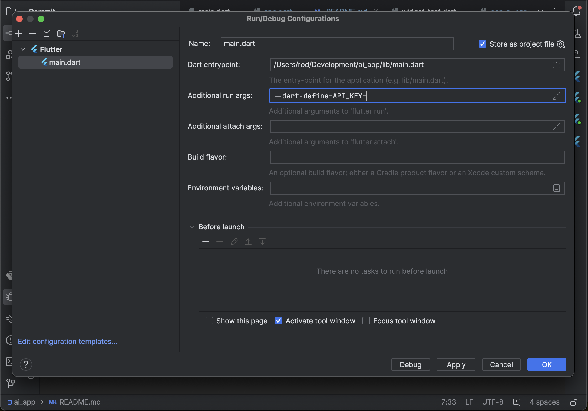

# Google Generative AI app

Sample app that uses Google Generative AI to receive an input text and present the response, just like Chat GPT or Google's Gemini

## Setup

You need to set your API_KEY, you can get one at https://aistudio.google.com/app/apikey
Then you can set it your Run Configurations as follows:

